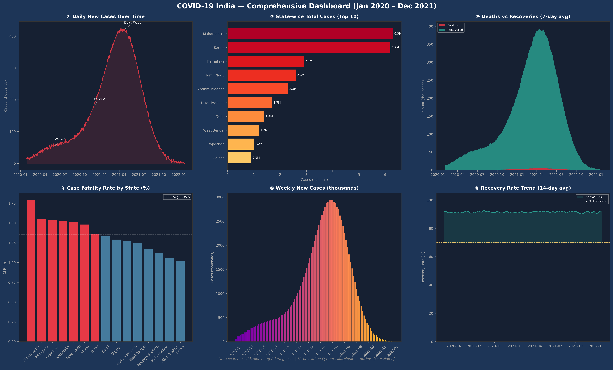

# 📊 COVID-19 India Multi-Panel Dashboard

A high-resolution, multi-panel data visualization dashboard analyzing COVID-19 trends in India using Python and Matplotlib.

This project presents **6 coordinated visualizations in a single figure**, combining time-series analysis, categorical comparisons, and statistical insights.

---

## 🚀 Project Highlights

- 📈 6-panel dashboard (2x3 layout)
- 📊 Multiple visualization types:
  - Line chart (daily cases trend)
  - Horizontal bar chart (top states)
  - Stacked area chart (deaths vs recoveries)
  - Sorted bar chart (case fatality rate)
  - Weekly aggregation bar chart
  - Recovery rate trend line
- 🎯 Synthetic dataset modeled on real COVID-19 India trends
- 🎨 Dark-themed professional design
- 🖼️ High-resolution export (300 DPI)

---

## 🖼️ Dashboard Preview

---

## 🧠 Key Insights

- Multiple COVID waves are clearly visible in the time series
- Maharashtra and Kerala show the highest case contributions
- Recovery rate improves significantly over time
- Weekly aggregation highlights peak periods effectively
- Case Fatality Rate varies across states

---

## 🛠️ Tech Stack

- Python
- Pandas
- NumPy
- Matplotlib

---

## 📂 Project Structure

covid-india-dashboard/
│── dashboard.py
│── README.md
│── requirements.txt
│── outputs/
│     └── project1_covid_dashboard.png

---

## ⚙️ Installation & Setup

python -m venv venv
venv\Scripts\activate
pip install -r requirements.txt

---

## ▶️ Run the Project

python dashboard.py

Output:
outputs/project1_covid_dashboard.png

---

## 📌 Data Note

- Uses synthetic data resembling real COVID-19 India trends
- Inspired by:
  - covid19india.org
  - data.gov.in

---

## 💡 Future Improvements

- Convert to Streamlit dashboard
- Add real-time data
- Add filters and interactivity

---
