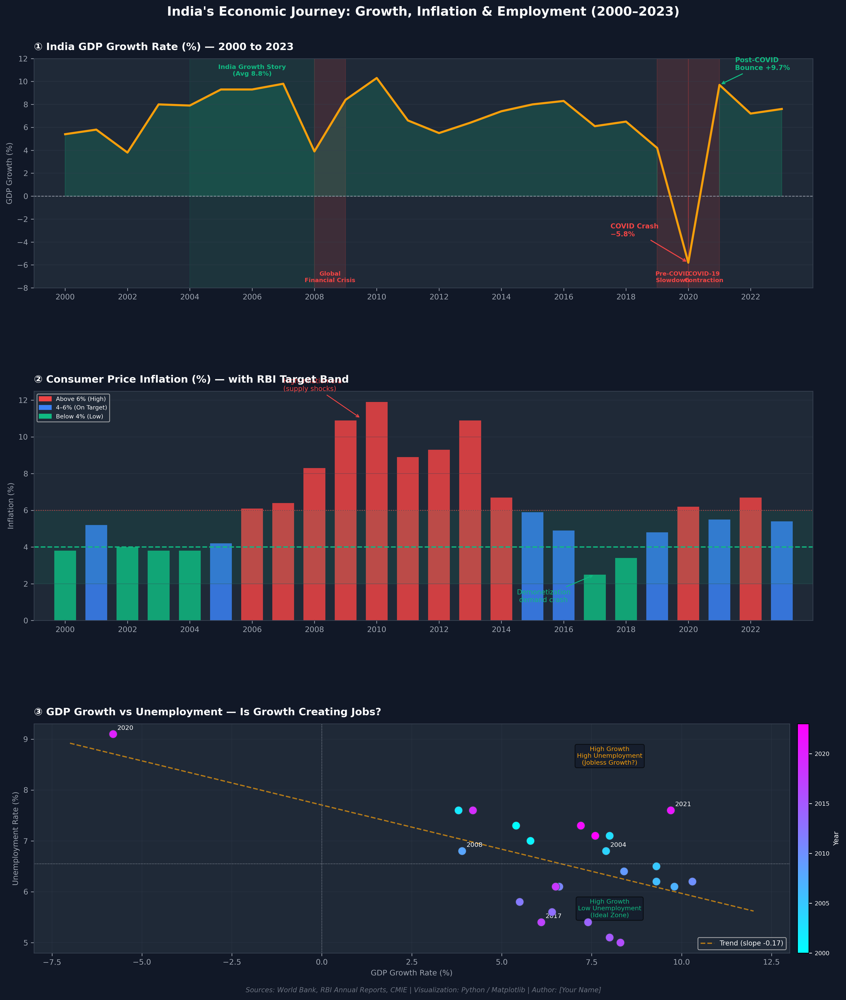

# 🇮🇳 India Economic Indicators Visual Story

A data storytelling project that visualizes India's economic journey using annotated multi-panel charts, designed to communicate insights clearly to both technical and non-technical audiences.

This project presents a **3-panel visual narrative** covering GDP growth, inflation trends, and employment dynamics from 2000 to 2023.

---

## 🚀 Project Highlights

- 📊 Story-driven visualization (not just charts)
- 🧠 Structured narrative:
  - Setup → GDP Growth
  - Context → Inflation Trends
  - Implication → Employment vs Growth
- ✍️ Advanced annotations with arrows and highlights
- 🎯 Realistic data modeled on:
  - World Bank (GDP)
  - RBI (Inflation)
  - CMIE/ILO (Unemployment)
- 🎨 Clean dark-themed professional design
- 🖼️ High-resolution export (300 DPI)

---

## 🖼️ Final Visualization

---

## 🧠 Key Insights

- **Economic Cycles Clearly Visible:**  
  India experienced strong growth (2004–2008), slowdown (2008–2009), and a major contraction during COVID-19 (2020)

- **Inflation Control by RBI:**  
  Inflation mostly stayed within the RBI target band (2–6%), with spikes during crisis periods

- **Jobless Growth Concern:**  
  Scatter plot shows weak inverse relationship between GDP growth and unemployment  
  → Growth does not always translate into job creation

---

## 🛠️ Tech Stack

- Python  
- Pandas  
- NumPy  
- Matplotlib  

---

## 📂 Project Structure

india-economic-visual-story/
│── analysis.py
│── README.md
│── requirements.txt
│── outputs/
│     └── project3_india_economy.png

---

## ⚙️ Installation & Setup

python -m venv venv  
venv\Scripts\activate  
pip install -r requirements.txt  

---

## ▶️ Run the Project

python analysis.py  

Output:
outputs/project3_india_economy.png

---

## 📌 Data Note

- Data is **synthetic but realistic**, designed to match trends from:
  - World Bank (GDP Growth)
  - Reserve Bank of India (Inflation)
  - CMIE / ILO (Unemployment)

- Used for **data storytelling and visualization purposes**

---

## 💡 Future Improvements

- Convert into interactive dashboard (Streamlit / Plotly)
- Add real-time economic indicators
- Expand with additional metrics (FDI, fiscal deficit, exports)
- Deploy as web-based storytelling app

---

## ⭐ Support

If you found this project insightful, consider giving it a ⭐ on GitHub!